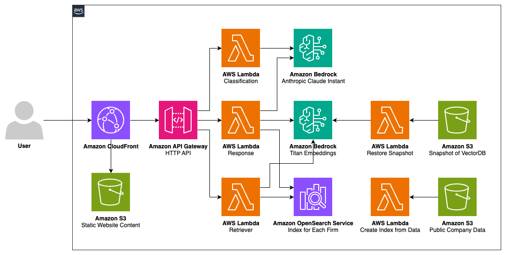

# Build a generative AI assistant to quickly derive insights and value

## Table of Contents
1. [About this Repository](#About)
2. [Architecture](#Learning)
3. [Tool Versions](#Versions)
4. [Prerequisites](#Prerequisites)
5. [Build and Deploy](#Build_Deploy)
6. [Worksop Activities](#Workshop)
7. [Destroy](#Destroy)
8. [Security](#Security)
9. [License](#License)

## About this Repository <a name="About"></a>

### Build a generative AI assistant to quickly derive insights and value

Financial institutions interact with a large volume of complex documents every day. But deriving accurate insights from annual reports, regulatory filings, insurance policies, and loan applications is a largely manual and time-consuming effort. In this builders’ session, construct a generative AI assistant to quickly extract information and generate content to support tasks such as question answering, enterprise search, and summarization. Explore use cases across financial services, including customer interaction, knowledge search and discovery, market research, and company financial analysis. 

This workshop was designed for session FSI303 for re:Invent 2023.

## Architecture <a name="Architecture"></a>



## Tool Versions <a name="Versions"></a>

To build and deploy this template the following tools are required.

1. NodeJs >= 20
2. npm >= 10
3. Python3 >= 3.11
4. Docker
5. boto3 >= 1.34.140

## Prerequisites <a name="Prerequisites"></a>

### Credentials

Use the secret access key of a user or export the temporary credentials.

### Lambda Layer Creation

The lambda functions in this workshop require some packages that will be imported via lambda layers. Before we deploy the application, a zip must be generated that has all the necessary packages.

Run each of the following commands in the terminal one by one.

Go to the utils layer folder
```
cd layers/utils_layer
```
Pull the correct docker container
```
docker pull public.ecr.aws/sam/build-python3.11:1.95.0-20230810182449
```
Run the container
```
docker run -it -v "$(pwd)":/var/task public.ecr.aws/sam/build-python3.11:1.95.0-20230810182449
```
Within the container, install and zip the packages with 
```
pip install -r requirements.txt -t ./python
```
and
```
zip -r python.zip ./python
```
Exit the container
```
exit
```
Return to top level directory
```
cd ../..
```

### OpenSearch Service Role

If the account has never used Amazon OpenSearch Service before, a service role will have to be create to deploy the workshop successfully. 

Run the following
```
npm run service_role
```
If you are unsure you may run the command above and the response message will say whether or not the account is okay to proceed.

Note: If you are having issues with boto3, create a virtual environment, install boto3, and try running the script above again. The code below is an example of how to do this.

```
python3 -m venv .venv
source .venv/bin/activate
pip install boto3
npm run service_role
```

### Build and Bootstrapping

If you are deploying to a new account or region you will need to bootstrap the CDK.  By default CDK bootstraps with AdministratorAccess policy which is restricted in certain environments.  If you need greater access than PowerUserAccess and IAMFullAccess, add the role arns to the list.

Before bootstrapping, we must build the application with the command below. There are more details on this in the next section.
```
npm run build
```

If you are installing the application into a region other than `us-east-1` you must bootstrap both regions.  You can do this by setting the environment variable `CDK_DEPLOY_REGION` to us-east-1 and running the command below, then clearing the environment variable to pick up the set default.  Or you can manually run the command with both regions provided.  See statements below.

```
npm run deploy.bootstrap
```

or manually

```
cd cdk && npx cdk bootstrap --cloudformation-execution-policies "arn:aws:iam::aws:policy/PowerUserAccess,arn:aws:iam::aws:policy/IAMFullAccess"
// or
cd cdk && npx cdk bootstrap ${AWS_ACCOUNT}/us-east-1 ${AWS_ACCOUNT}/us-west-1 --cloudformation-execution-policies "arn:aws:iam::aws:policy/PowerUserAccess,arn:aws:iam::aws:policy/IAMFullAccess"
```

## Build and Deploy <a name="Build_Deploy"></a>

Here is a helper syntax to build and deploy in one step

```
npm run build && npm run deploy
```

### Build 

The top level package.json is only for easy to use top level commands and doesn't contain any packages so there is no reason to install it.  When pulling latest its always best to run a build all to ensure you have the latest code. 

To build the entire project run:

```
npm run build
```

Then during development, individual parts of the project can be built separately using the scoped commands:

```
npm run build.iac
npm run build.web
```

### Deploy

To deploy an environment by branch name, run:

```
npm run deploy
```

To deploy other environments either copy the commands and rename the stack name or use the STACK_NAME environment variable :

```
export STACK_NAME="prod"
npm run deploy
```

To deploy into another account or region you can set the context variables by:

```
npm run deploy -- -c region=eu-west-1
```

**Once deployed, you will need to create a Cognito User to access the web application. Go to the console and add a new user to the user pool. Then, when you login use your email as the username.**


## Workshop Activities <a name="Workshop"></a>

To perform the workshop follow the instructions at the link:

**https://catalog.us-east-1.prod.workshops.aws/workshops/8b9976db-f4b2-4554-ae82-ce9e552e20ca/en-US**


## Destroy <a name="Destory"></a>

To destroy the dev environment, run:

```
npm run destroy
```

Note: There might be issues removing s3 buckets with logs. You are welcome to delete this manually or allow the s3 log bucket, and it contents, to remain after destroying the application.


## Security <a name="Security"></a>

See [CONTRIBUTING](CONTRIBUTING.md#security-issue-notifications) for more information.


## License <a name="License"></a>

This library is licensed under the MIT-0 License. See the LICENSE file.

